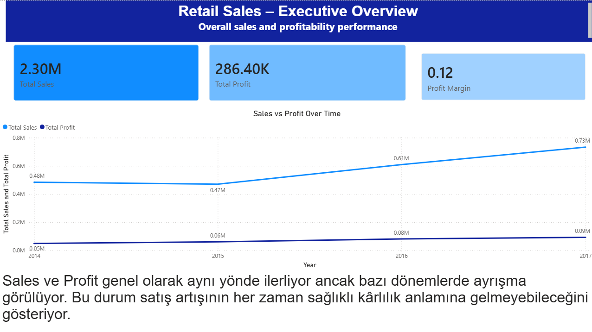

# Retail Sales Profitability Analysis (Power BI)

## Project Overview
This project analyzes retail sales data with a focus on the gap between revenue growth and profitability.
Rather than only reporting sales performance, the analysis aims to uncover **why sales do not always translate into profit** and which products require action.

## Key Business Questions
- Are sales and profit growing together over time?
- Which product categories drive revenue vs. profitability?
- Are discounts increasing sales at the expense of profit?
- Which high-selling products negatively impact overall margins?

## Dataset
- Sample Superstore dataset
- Granularity: product-level order transactions
- Key fields: Sales, Profit, Discount, Category, Sub-Category, Order Date

## Analysis Approach
1. **Executive Overview**
   - Overall trends in sales, profit, and profit margin
   - Identification of periods where sales and profit diverge
   -  () 

2. **Sales vs Profit Drivers**
   - Category-level comparison of revenue and profitability
   - Detection of high-sales, low-margin categories

3. **Action View**
   - Discount vs profit relationship analysis
   - Identification of products requiring pricing or discount strategy review

## Tools & Skills
- Power BI
- DAX (Measures & KPIs)
- Business-focused data analysis
- Data visualization for decision-making

## Outcome
The dashboard provides actionable insights for pricing and discount strategies, helping decision-makers focus on **profitable growth rather than volume-driven growth**.
